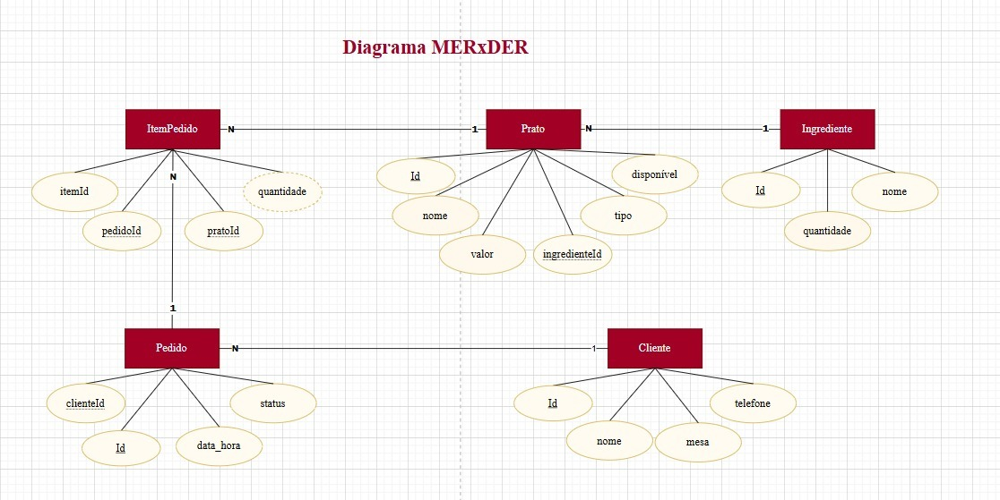
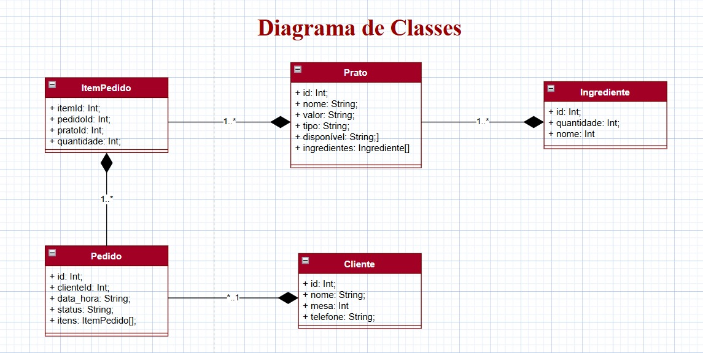
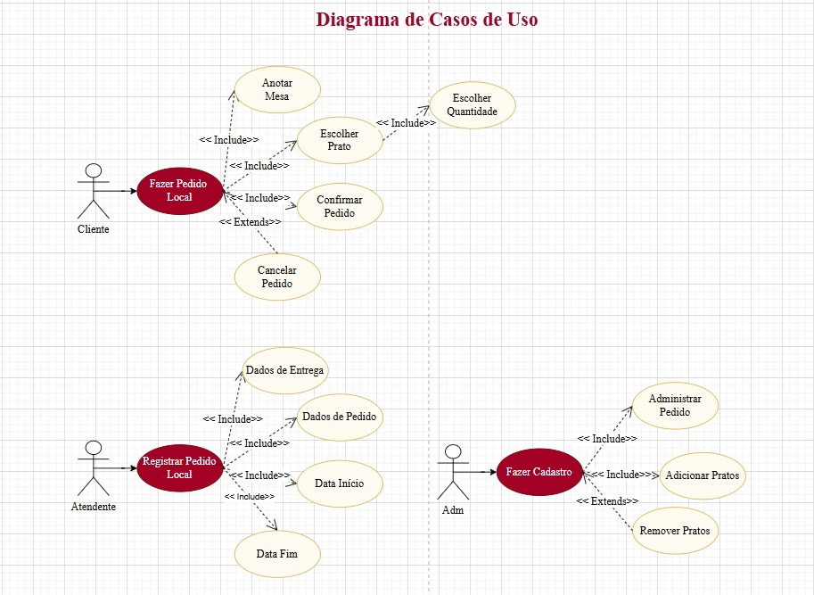
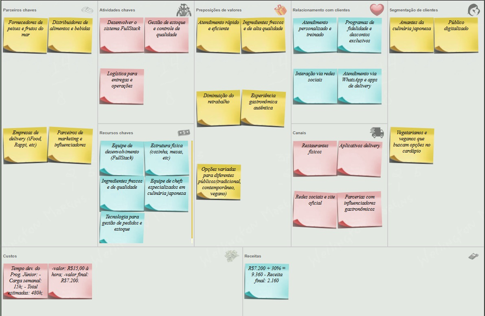

# 🍣 TCC Koi Sushi

## Sobre o Projeto
Este trabalho de conclusão de curso tem como foco o desenvolvimento de um sistema digital para um restaurante de sushi, onde os pedidos são realizados diretamente pelos clientes através de tablets disponíveis nas mesas.  
A solução busca modernizar a experiência do rodízio, tornando o processo de pedidos mais rápido, intuitivo e eficiente.

## Objetivo
O principal objetivo do projeto é **reduzir o desperdício de comida durante o rodízio**.  
Para isso, o sistema inclui uma funcionalidade de alerta: quando o cliente solicita mais de 5 unidades de um mesmo item, o tablet exibe uma mensagem de aviso para que ele confirme se realmente deseja aquela quantidade.

## Diagramas

## Quadro Kanban

---
 **Autores:** Dahra Fagionato, Nicole Santos, Pedro Lima 

 **Ano:** 2025
